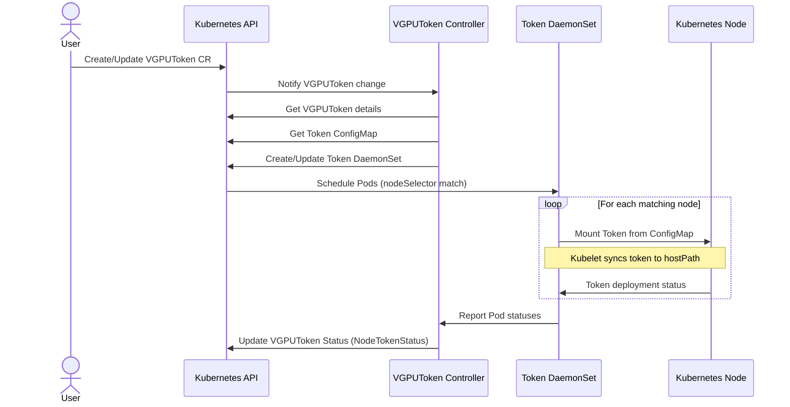

# VGPUToken Design

## Summary

The NVIDIA vGPU Token Manager is a Kubernetes controller that streamlines the distribution and validation of NVIDIA vGPU JWT tokens across nodes in a Kubernetes cluster. Using the operator pattern, it automatically propagates license tokens to required nodes and verifies proper licensing, while providing a monitoring mechanism to ensure NVIDIA GRID services restart when tokens change. This is especially helpful in environments where the nvidia driver is preconfigured on the nodes.

## Motivation

NVIDIA vGPUs fetch licenses using JWTs managed via the host's gridd service. In Kubernetes, manual JWT handling is complex. This initiative proposes a Kubernetes Operator to automate JWT distribution for vGPU nodes. A key function is to also monitor and report vGPU license status using Kubernetes-native mechanisms, simplifying management and providing integrated cluster visibility.

## Sequence Diagram

